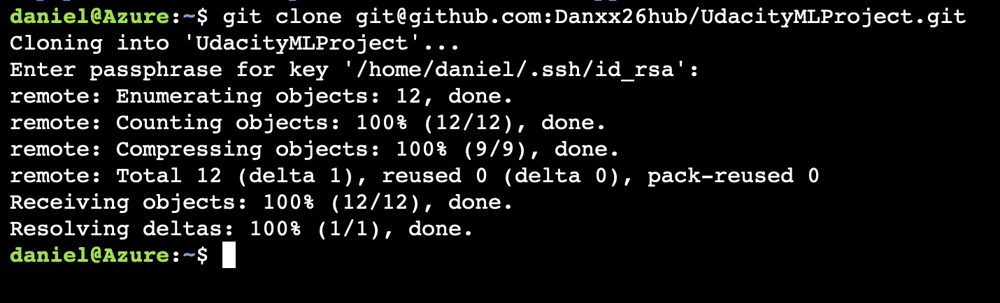

# UdacityMLProject
this is the ML Project 
## Added new SSH keys 

* Cloning the project to my Azure cloud shell
* Configured the Github actions.
* Ran a sample test.
    * Changed the Python version in the .yml file to 3.7.12
    * tested by commiting new code to the repo.
* See Screenshot below.

* Update 
